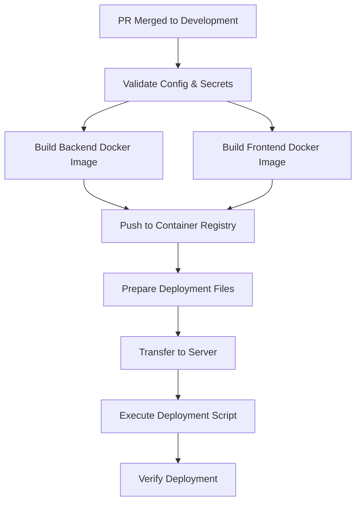

# 3. Continuous Integration/Continuous Deployment 🔄

[<- Back: Project Setup & Architecture](./01-project-setup-architecture.md) | [Next: Docker & Containerization ->](./04-docker-containerization.md)

---
- [3a. CI Pipeline Configuration](./03a-ci-pipeline-configuration.md) 
- [3b. CD Workflow Design](./03b-cd-workflow-design.md) 
- [3c. Environment-Specific Deployments](./03c-environment-specific-deployments.md) 
- [3d. Validation & Verification Steps](./03d-validation-verification-steps.md) 
---

## Table of Contents

- [Introduction](#introduction)
- [CI/CD Principles for Rust Projects](#cicd-principles-for-rust-projects)
- [Workflow Triggers and Events](#workflow-triggers-and-events)
- [Pipeline Stages](#pipeline-stages)
- [Environment Management](#environment-management)
- [Security Considerations](#security-considerations)

## Introduction

Continuous Integration and Continuous Deployment (CI/CD) form the backbone of modern software delivery, enabling rapid iteration while maintaining quality and stability. For Rust-based projects like WhoKnows, effective CI/CD pipelines provide automated building, testing, and deployment of components while respecting Rust's strict compilation and safety guarantees.

The WhoKnows project implements a robust CI/CD approach using GitHub Actions, container registries, and automated deployment scripts that ensure consistent and reliable delivery across environments.

## CI/CD Principles for Rust Projects

Effective CI/CD for Rust projects reflects several key principles:

1. **Build Caching**: Leveraging Rust's build artifacts to speed up CI/CD pipelines
2. **Comprehensive Testing**: Executing unit, integration, and possibly end-to-end tests
3. **Container-Based Deployment**: Packaging applications as containers for consistency
4. **Environment Isolation**: Maintaining separate development, staging, and production environments
5. **Automated Verification**: Validating deployments through automated checks

### Rust-Specific Considerations

```rust
// Example of conditional compilation for environment-specific code
#[cfg(feature = "development")]
fn initialize_logging() {
    // Development logging configuration
    env_logger::init_from_env(
        env_logger::Env::default().filter_or(env_logger::DEFAULT_FILTER_ENV, "debug")
    );
}

#[cfg(not(feature = "development"))]
fn initialize_logging() {
    // Production logging configuration
    env_logger::init_from_env(
        env_logger::Env::default().filter_or(env_logger::DEFAULT_FILTER_ENV, "info")
    );
}
```

## Workflow Triggers and Events

The CI/CD workflows in WhoKnows are triggered by specific Git events:

| Workflow | Trigger Event | Condition | Purpose |
|----------|--------------|-----------|---------|
| CI | Push to any branch | Changes in backend/ or frontend/ | Validate code quality |
| CI | Pull Request to main | Changes in backend/ or frontend/ | Gate code changes |
| CD (dev) | PR closed on development | PR was merged | Deploy to development env |
| CD (prod) | PR closed on main | PR was merged | Deploy to production env |

### Event-Driven Design

```yaml
# Example from GitHub Actions workflow
name: CD Development

on:
  pull_request:
    types:
      - closed
    branches:
      - development

jobs:
  deploy:
    if: github.event.pull_request.merged == true
    runs-on: ubuntu-latest
    steps:
      # Deployment steps
```

## Pipeline Stages

The WhoKnows CI/CD pipelines are structured in distinct stages, each with a specific responsibility:

1. **Validation**: Ensure all necessary configuration and secrets are available
2. **Build**: Compile the application and create container images
3. **Test**: Execute tests to verify functionality
4. **Publish**: Push container images to a registry
5. **Deploy**: Update the running application with new versions

### Pipeline Flow



## Environment Management

The WhoKnows project maintains separate environments, each with its own configuration:

- **Development**: For ongoing feature development and integration
- **Staging**: For pre-release testing (if applicable)
- **Production**: For live user traffic

Environment-specific variables and secrets are managed securely through GitHub Secrets and injected during deployment.

### Configuration Strategy

```yaml
# Example of environment configuration in GitHub Actions
jobs:
  deploy:
    environment: development
    env:
      DEPLOY_DIR: ~/deployment/whoknows
      GHCR_REGISTRY: ghcr.io
    steps:
      - name: Prepare .env file
        run: |
          echo "${{ secrets.DEV_ENV_FILE }}" > .env.development
          echo "IMAGE_TAG_BACKEND=${{ needs.build-push.outputs.backend_image_sha }}" >> .env.development
          echo "IMAGE_TAG_FRONTEND=${{ needs.build-push.outputs.frontend_image_sha }}" >> .env.development
```

## Security Considerations

CI/CD pipelines must handle sensitive information securely:

1. **Secret Management**: Using GitHub Secrets for credentials and keys
2. **Least Privilege**: Limiting access to deployment environments
3. **Artifact Integrity**: Ensuring container images aren't tampered with
4. **Dependency Scanning**: Checking for vulnerabilities in dependencies

### Security Best Practices

```yaml
# Example of secure SSH handling in deployment
- name: Configure SSH
  run: |
    mkdir -p ~/.ssh
    echo "${{ secrets.DEV_SSH_PRIVATE_KEY }}" > ~/.ssh/id_rsa
    chmod 600 ~/.ssh/id_rsa
    ssh-keyscan -t rsa ${{ secrets.DEV_SERVER_HOST }} >> ~/.ssh/known_hosts
```

## Example: Deployment Workflow

Here's how the WhoKnows project's CD pipeline deploys to the development environment:

1. A pull request is merged into the development branch
2. GitHub Actions triggers the CD workflow
3. The workflow validates that all required secrets are available
4. Docker images for backend and frontend are built with appropriate tags
5. Images are pushed to GitHub Container Registry
6. Environment-specific configuration is prepared
7. Files are securely transferred to the deployment server
8. Deployment script is executed on the server
9. The script pulls new images and updates the running containers
10. Verification checks confirm successful deployment

### Key Components

```
- GitHub Actions Workflows (.github/workflows/cd.dev.yml)
- Docker Compose Templates (docker-compose.dev.yml)
- Environment Files (.env.development)
- Deployment Scripts (deployment/scripts/deploy.sh)
```

---

[<- Back: Project Setup & Architecture](./01-project-setup-architecture.md) | [Next: Docker & Containerization ->](./04-docker-containerization.md)
